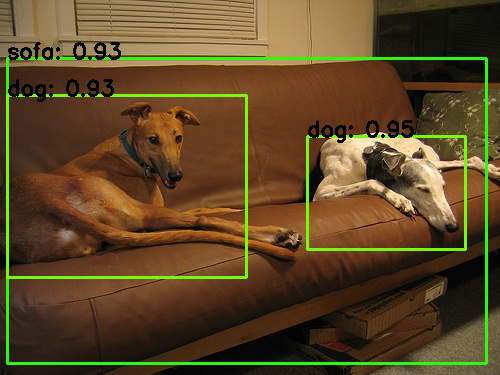

# 👿 De Monet - All of Object Detection


PyTorch training code and models reimplentation for object detection as described in [Liu et al. (2015), SSD: Single Shot MultiBox Detector](https://arxiv.org/abs/1512.02325). *Currently work in process, very pleasure for suggestion and cooperation.*



## 🆕 What's New

- **July 22, 2020:** DEMONET have support for `TorchScript`.
- **July 25, 2020:** DEMONET can do inference using `onnxruntime`.
- **September 18, 2020:** DEMONET can do inference using `libtorch` cpp interface. 

## 🛠 Usage

There are no extra compiled components in DEMONET and package dependencies are minimal, so the code is very simple to use. We provide instructions how to install dependencies via conda. First, clone the repository locally:

```bash
git clone https://github.com/vanillapi/demonet.git
```

Then, install PyTorch 1.6+ and torchvision 0.7+:

```bash
conda install pytorch torchvision cudatoolkit=10.2 -c pytorch
```

Install pycocotools (for evaluation on COCO) and scipy (for training):

```bash
conda install cython scipy
pip install -U 'git+https://github.com/cocodataset/cocoapi.git#subdirectory=PythonAPI'
```

That's it, should be good to train and evaluate detection models.

## 🤗 Pretrained Models

We provide [`ssd_lite_mobilenet_v2`](models/ssd_mobilenet.py) ~~pretrained model [weights](https://drive.google.com/file/d/11isfA_F3QUzsWVzflrY2MXJYqwNt2xCV/view?usp=sharing)~~ (For the SSD network structure is frequently updated now, the provided model can't be loaded, contact me for the lastest model via [email](mailto:zhiqwang@outlook.com)), with map 68.39 on VOC07 test subset (Training using VOC07+12 trainval subset).

<details>

  <summary>Average Precision Across All Classes = 0.6839</summary><br/>

  ```log
  AP for aeroplane = 0.6822
  AP for bicycle = 0.7829
  AP for bird = 0.6418
  AP for boat = 0.5453
  AP for bottle = 0.3479
  AP for bus = 0.7876
  AP for car = 0.7411
  AP for cat = 0.8305
  AP for chair = 0.5358
  AP for cow = 0.6127
  AP for diningtable = 0.7282
  AP for dog = 0.7757
  AP for horse = 0.8281
  AP for motorbike = 0.8114
  AP for person = 0.7201
  AP for pottedplant = 0.4385
  AP for sheep = 0.6250
  AP for sofa = 0.7706
  AP for train = 0.8191
  AP for tvmonitor = 0.6545
  ```
</details>

## 🧗 Data Preparation

Support trainint with COCO and PASCAL VOC format (chosen with the parameter `--dataset-file [coco/voc]`). With COCO format we expect the directory structure to be the following:

```bash
.
└── path/to/data-path/
    ├── annotations  # annotation json files
    └── images       # root path of images
```

When you are using PASCAL VOC format, we expect the directory structure to be the following:

```bash
.
└── path/to/data-path/
    └── VOCdevkit
        ├── VOC2007
        └── VOC2012
```

## 🦄 Training and Evaluation Snippets

<details>
  <summary><b>Example training script</b></summary><br/>

  ```bash
  CUDA_VISIBLE_DEVICES=[GPU_ID] python -m train \
      --arch ssd_lite_mobilenet_v2 \
      --image-size 300 \
      --dataset-file voc \
      --train-set trainval \
      --val-set test \
      --dataset-year 2007 2012 \
      --data-path path/to/data-path/ \
      --output-dir [CHECKPOINT_PATH] \
      --epochs [NUM_EPOCHS] \
      --num-classes [NUM_CLASSES] \
      --batch-size 32 \
      --lr 0.01
  ```

</details>

<details>
  <summary><b>Example evaluation script</b></summary><br/>

  Evaluation on voc dataset

  ```bash
  CUDA_VISIBLE_DEVICES=[GPU_ID] python -m eval_voc \
      --arch ssd_lite_mobilenet_v2 \
      --image-size 300 \
      --dataset-file voc \
      --val-set test \
      --dataset-year 2007 \
      --data-path path/to/data-path/ \
      --num-classes [NUM_CLASSES] \
      --batch-size 32 \
      --resume [CHECKPOINT_PATH] \
      --output-dir [OUTPUT_DIR]
  ```

  Evaluation on coco dataset

  ```bash
  CUDA_VISIBLE_DEVICES=[GPU_ID] python -m train \
      --arch ssd_lite_mobilenet_v2 \
      --image-size 300 \
      --dataset-file coco \
      --dataset-mode pascal \
      --val-set test \
      --dataset-year 2007 \
      --data-path path/to/data-path/ \
      --resume [CHECKPOINT_PATH] \
      --num-classes [NUM_CLASSES] \
      --batch-size 32 \
      --test-only
  ```
</details>

## 🎓 Acknowledgement

- This repo borrows the architecture design and part of the code from [DETR](https://github.com/facebookresearch/detr) and [torchvision](https://github.com/pytorch/vision/tree/master/torchvision/models/detection).
- The implementation of `ssd_lite_mobilenet_v2` borrow the code from [qfgaohao's pytorch-ssd](https://github.com/qfgaohao/pytorch-ssd) and [lufficc's SSD](http://github.com/lufficc/SSD/).
